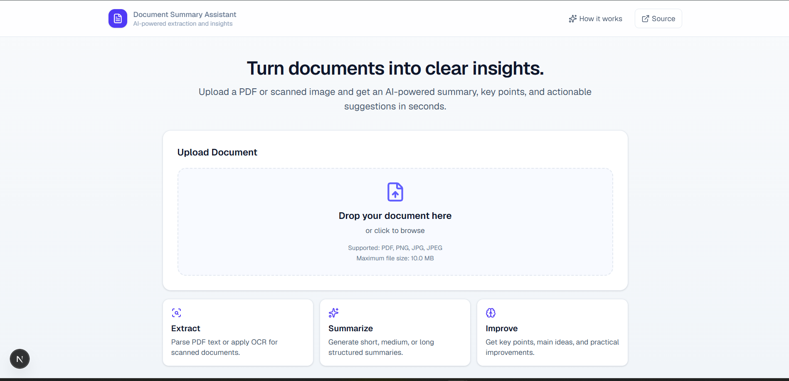
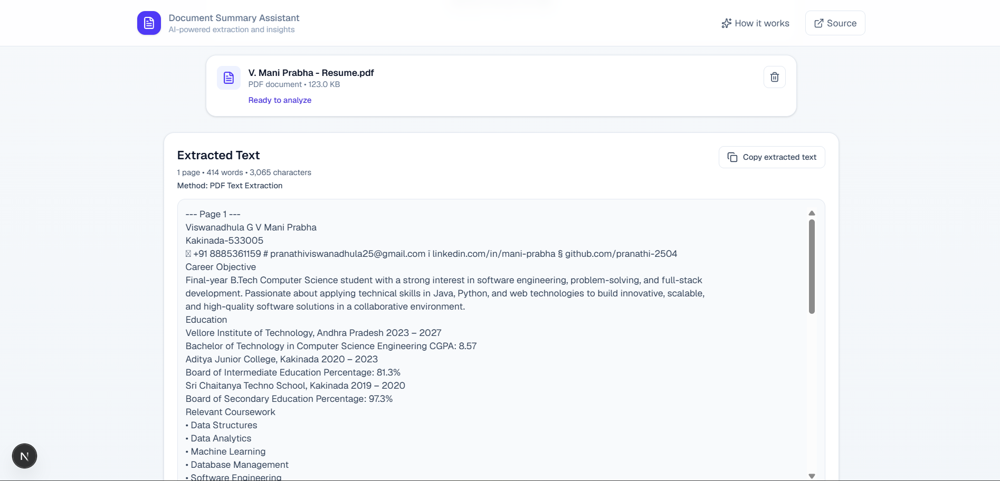
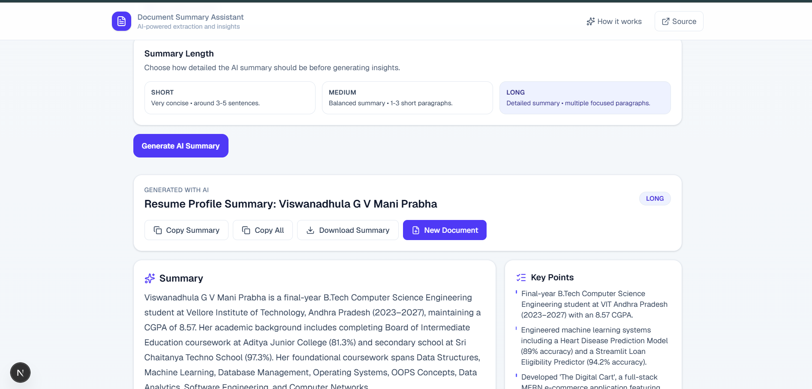
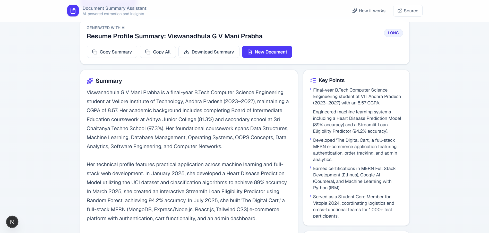
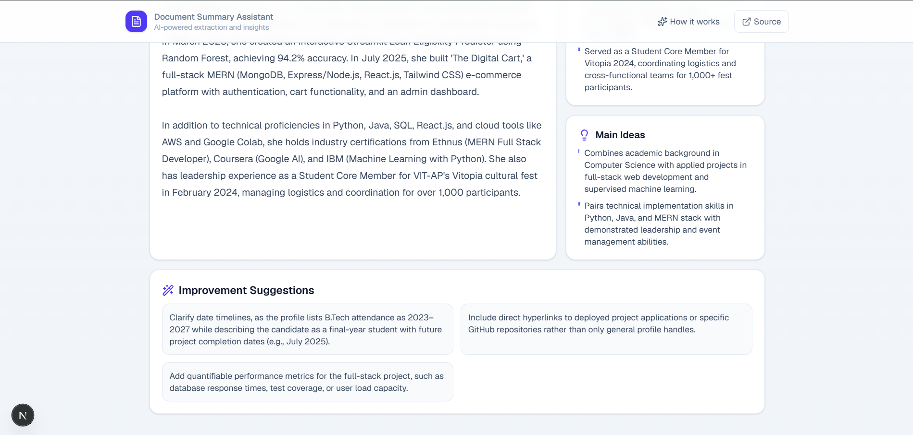

# Document Summary Assistant

## Overview

Document Summary Assistant is a production-focused Next.js app that extracts text from PDFs and images, applies OCR for scanned documents, and generates structured AI insights using Google Gemini.

Document Summary Assistant addresses the challenge of quickly understanding PDFs and scanned documents. The application uses Next.js, TypeScript, React, and Tailwind CSS to provide a responsive, accessible interface with drag-and-drop uploads and clear processing states.

PDF.js extracts selectable PDF text page by page. When a PDF contains little or no readable text, its pages are rendered to canvas and processed with Tesseract.js OCR. Images are sent directly through the same OCR workflow. Extracted content is previewed before users select a short, medium, or long summary format.

The client sends the extracted text and selected summary length to a secure  /api/summarize  route. The server calls Google Gemini using the private  GEMINI_API_KEY , requests structured JSON, validates the response with Zod, and returns the title, summary, key points, main ideas, and improvement suggestions.

The UI includes progress indicators, validation, error handling, copy/download actions, and a reset flow. Documents are processed temporarily in the browser and are not stored permanently. The project is Vercel-ready and requires only the Gemini environment variable for deployment.

## Live Demo

**Live Application:**  
[Document Summary Assistant](https://document-summary-assistant-psi-lake.vercel.app/)

**Project Demo:**  
[View Demo on Google Drive](https://drive.google.com/file/d/1LieHOpfKjC2vLsKKH0ImpEmSvx-CU32S/view?usp=sharing)

## Features

- PDF upload
- Image upload
- Drag-and-drop
- PDF text extraction
- OCR
- Scanned PDF OCR fallback
- AI summaries
- Short/medium/long modes
- Key points
- Main ideas
- Improvement suggestions
- Responsive UI

## Screenshots

### 1. Main Page



### 2. Document Processing and Extracted Text



### 3. AI Summary Options



### 4. AI Summary



### 5. Key Insights & Suggestions



## Tech Stack

- **Next.js 16 + App Router** for full-stack web delivery and Vercel-ready deployment.
- **TypeScript** for strict typing and reliability.
- **React 19** for interactive state-driven UX.
- **Tailwind CSS v4** for fast, consistent styling.
- **Lucide React** for clean iconography.
- **pdfjs-dist** for extracting text and rendering pages for OCR fallback.
- **Tesseract.js** for browser-based OCR.
- **Google Gemini API** for structured summarization.
- **Zod** for schema validation and robust parsing.

## Architecture

Upload  
→ Validation  
→ Extraction (PDF text or OCR)  
→ OCR fallback for scanned PDFs  
→ Extracted text preview  
→ Gemini summarization API  
→ Structured summary results

## Getting Started

```bash
git clone <your-repo-url>
cd Document-Summary-Assistant
npm install
```

Create `.env.local`:

```bash
GEMINI_API_KEY=your_key_here
```

Run:

```bash
npm run dev
```

Then open `http://localhost:3000`.

## Environment Variables

- `GEMINI_API_KEY`: Required for AI summarization.

If missing, extraction and OCR still work, but summary generation returns a clear configuration error.

## Deployment

This app is Vercel-ready.

1. Push the repository to GitHub.
2. Import the repository in Vercel.
3. Add `GEMINI_API_KEY` in Project Settings → Environment Variables.
4. Deploy.

## Limitations

- OCR accuracy depends on image/scan quality.
- Large files take longer to process.
- AI provider limits/quotas may apply.
- Browser OCR can be resource intensive.
- Scanned-PDF fallback OCR is limited to first 15 pages for performance.

## Future Improvements

- User accounts
- Document history
- Multiple language OCR
- Export PDF
- More AI models
- Persistent storage
- Side-by-side document viewer
